```mermaid
flowchart TD
    classDef master fill:#002,stroke:#039
    classDef auxiliary fill:#200,stroke:#930

    master_file[(Master File)]
    auxiliary_file[(Auxiliary File)]
    master_uvdata([MASTR.UVDATA.1])
    auxiliary_uvdata([AUXIL.UVDATA.1])
    master([MASTR.MSORT.1])
    auxiliary([AUXIL.MSORT.1])
    cl1m((CL1))
    cl1a((CL1))
    class master_file,master_uvdata,master,cl1m master
    class auxiliary_file,auxiliary_uvdata,auxiliary,cl1a auxiliary

    fitldm[FITLD]
    fitlda[FITLD]
    msortm[MSORT]
    msorta[MSORT]
    indxrm[INDXR]
    indxra[INDXR]

    master_file --> fitldm --> master_uvdata --> msortm --> master --> indxrm --> cl1m
    auxiliary_file --> fitlda --> auxiliary_uvdata --> msorta --> auxiliary --> indxra --> cl1a

    subgraph load[load.py]
        fitldm
        fitlda
        master_uvdata
        auxiliary_uvdata
        msortm
        msorta
        master
        auxiliary
        indxrm
        indxra
        cl1m
        cl1a
    end
```

```mermaid
flowchart TD
    classDef master fill:#002,stroke:#039
    classDef auxiliary fill:#200,stroke:#930

    master([MASTR.MSORT.1])
    auxiliary([AUXIL.MSORT.1])
    antab_master[(ANTAB File)]
    antab_auxiliary[(ANTAB File)]
    sn1m((SN1))
    sn1a((SN1))
    sn2m((SN2))
    sn2a((SN2))
    sn3m((SN3))
    sn3a((SN3))
    cl1m((CL1))
    cl1a((CL1))
    cl2m((CL2))
    cl2a((CL2))
    cl3m((CL3))
    cl3a((CL3))
    gcty1m((GC1, TY1))
    gcty1a((GC1, TY1))
    bp1m((BP1))
    bp1a((BP1))
    class master,antab_master,sn1m,sn2m,sn3m,cl1m,cl2m,cl3m,gcty1m,bp1m master
    class auxiliary,antab_auxiliary,sn1a,sn2a,sn3a,cl1a,cl2a,cl3a,gcty1a,bp1a auxiliary

    accorm[ACCOR]
    accora[ACCOR]
    snedtm[SNEDT]
    snedta[SNEDT]
    antabm[ANTAB]
    antaba[ANTAB]
    apcalm[APCAL]
    apcala[APCAL]
    bpassm[BPASS]
    bpassa[BPASS]

    antab_master --> antabm --> gcty1m --> apcalm --> sn3m --> cl3m
    master --> accorm --> sn1m --> snedtm --> sn2m --> cl2m
    cl1m --CLCAL--> cl2m --CLCAL--> cl3m --> bpassm --> bp1m
    cl2a -.-> apcala

    cl2m -.-> apcalm
    cl1a --CLCAL--> cl2a --CLCAL--> cl3a --> bpassa --> bp1a
    auxiliary --> accora --> sn1a --> snedta --> sn2a --> cl2a
    antab_auxiliary --> antaba --> gcty1a --> apcala --> sn3a --> cl3a
  
    subgraph amp_cal[amp_cal.py]
        accorm
        accora
        sn1m
        sn1a
        snedtm
        snedta
        sn2m
        sn2a
        cl2m
        cl2a
        antab_master
        antab_auxiliary
        antabm
        antaba
        gcty1m
        gcty1a
        apcalm
        apcala
        sn3m
        sn3a
        cl1m
        cl1a
        cl3m
        cl3a
        bpassm
        bpassa
        bp1m
        bp1a
    end
```

# Loading Data

Loads both the master file (containing the target, RCW142 and primary calibrator, NRAO530) and the auxiliary file (containing the primary calibrator, NRAO530 and secondary calibrator, J1752-29) into AIPS. The visibilities in the catalogues are then sorted and indexed. 

Note: The auxiliary file is loaded only for the first IF as it covers the whole frequency range of the master file. The auxiliary file only has 64 channels, unlike the master file that has 1024. 

**Flowchart**



**ParselTongue**

Syntax:

```
ParselTongue load.py [-h] USER_NO -m MASTER_FILE -a AUXILIARY_FILE -s SOURCE_1 [SOURCE_2 ...] -d DISK [-cl CLINT] 
```

| Name        | Flag | Arguments               | Description                            |
| ----------- | ---- | ----------------------- | -------------------------------------- |
| USER_NO     |      |                         | AIPS user number                       |
| --help      | -h   |                         | Displays help message                  |
| --master    | -m   | MASTER_FILE             | Master visibility file name to load    |
| --auxiliary | -a   | AUXILIARY_FILE          | Auxiliary visibility file name to load |
| --sources   | -s   | SOURCE_1, [SOURCE_2, …] | Sources to read in files               |
| --disk      | -d   | DISK                    | AIPS disk number to load into          |
| --clint     | -cl  | CLINT                   | Integration time in minutes            |

Usage in this context:

```
ParselTongue load.py <user no> -m <exper code>/<master file> -a <exper code>/<auxiliary file> -s NRAO530 J1752-29 RCW142 -d 1 -cl 0.0273
```

# Flagging

Performs flagging on both the master and auxiliary catalogues based on a YAML flag file created based on manual inspection of visibilities in both catalogues. 

**ParselTongue**

Syntax:

```
ParselTongue flag.py USER_NO [-h] -m NAME CLASS SEQ DISK -a NAME CLASS SEQ DISK -f FLAG_FILE 
```

| Name        | Flag | Arguments           | Description                     |     |
| ----------- | ---- | ------------------- | ------------------------------- | --- |
| USER_NO     |      |                     | AIPS user number                |     |
| --help      | -h   |                     | Displays help message           |     |
| --master    | -m   | NAME CLASS SEQ DISK | Master catalogue information    |     |
| --auxiliary | -a   | NAME CLASS SEQ DISK | Auxiliary catalogue information |     |
| --flagfile  | -f   | FLAG_FILE           | YAML flag file name to apply    |     |

Usage in this context: 

```
ParselTongue flag.py <user no> -m MASTR MSORT 1 1 -a AUXIL MSORT 1 1 -f <exper code>/<exper code>.flag
```

# Amplitude Calibration

Correct amplitudes in cross-correlation spectra due to errors in sampler thresholds based on auto-correlation spectra, loads antenna gain and system temperature data from ANTAB files, generate amplitude calibration solutions, and generate amplitude bandpass table from primary calibrator (NRAO530).

**Flowchart**



**ParselTongue**

Syntax: 

```
ParselTongue amp_cal.py USER_NO [-h] -m NAME CLASS SEQ DISK -a NAME CLASS SEQ DISK -f FLAGVER --accor_solint ACCOR_SOLINT --antab_file ANTAB_FILE [--apcal_solint APCAL_SOLINT] --bpass_sources SOURCE_1 [SOURCE_2 ...]
```

| Name            | Flag | Arguments               | Description                                     |
| --------------- | ---- | ----------------------- | ----------------------------------------------- |
| USER_NO         |      |                         | AIPS user number                                |
| --help          | -h   |                         | Displays help message                           |
| --master        | -m   | NAME CLASS SEQ DISK     | Master catalogue information                    |
| --auxiliary     | -a   | NAME CLASS SEQ DISK     | Auxiliary catalogue information                 |
| --flagver       | -f   | FLAGVER                 | Flag table version to apply                     | 
| --accor_solint  |      | ACCOR_SOLINT            | ACCOR solution interval in minutes              |
| --antab_file    |      | ANTAB_FILE              | ANTAB file to apply                             |
| --apcal_solint  |      | APCAL_SOLINT            | APCAL solution interval in minutes (default: 0) |
| --bpass_sources |      | SOURCE_1, [SOURCE_2, …] | Sources to use for BPASS                        |

Usage in this context:

```
ParselTongue amp_cal.py <user no> -m MASTR MSORT 1 1 -a AUXIL MSORT 1 1 -f 1 --accor_solint 0.0273 --antab_file <exper code>/ANTAB<exper code>.txt --bpass_sources NRAO530
```

# Continuum Delay Calibrations

Performs fringe fitting on primary calibrator (NRAO530) to correct for station clock synchronization residual errors, fringe fitting on secondary calibrator (J1752-29) to correct for atmospheric fluctuations, fringe fitting on primary calibrator (NRAO530) and generate phase bandpass table from primary calibrator (NRAO530).

**Flowchart**



```mermaid
flowchart TD
    classDef master fill:#002,stroke:#039
    classDef avspc fill:#020,stroke:#093
    classDef auxiliary fill:#200,stroke:#930

    master([MASTR.MSORT.1])
    master_avspc([MASTR.AVSPC.1])
    auxiliary([AUXIL.MSORT.1])
    sn1ma((SN1))
    sn2ma((SN2))
    sn4m((SN4))
    sn5m((SN5))
    sn6m((SN6))
    sn4a((SN4))
    sn5a((SN5))
    cl3m((CL3))
    cl3a((CL3))
    cl4m((CL4))
    cl4a((CL4))
    cl5m((CL5))
    cl6m((CL6))
    bp1m((BP1))
    bp2m((BP2))
    
    class master,sn4m,sn5m,sn6m,cl3m,cl4m,cl5m,cl6m,bp1m,bp2m master
    class master_avspc,sn1ma,sn2ma avspc
    class auxiliary,sn4a,sn5a,cl3a,cl4a,bp1a auxiliary

    avspc[AVSPC]
    fring_delaym["FRING<br>(Delay)"]
    fring_delaya["FRING<br>(Delay)"]
    fring_atmos["FRING<br>(Atmos)"]
    fring_bpass["FRING<br>(Band)"]
    bpass[BPASS]

    bp1m --> bpass 
    master_avspc --> fring_bpass --> sn2ma --TACOP--> sn6m --> cl4m --> bpass --> bp2m
    cl3m --CLCAL--> cl5m
    master --> avspc --> master_avspc --> fring_delaym --> sn1ma --TACOP--> sn4m --> cl5m --CLCAL--> cl6m
    
    auxiliary --> fring_delaya --> sn4a --> cl4a
    auxiliary --> fring_atmos --> sn5a --TACOP--> sn5m ---> cl6m
    cl3a --CLCAL--> cl4a -.-> fring_atmos

    subgraph continuum_cal[continuum_cal.py]
        master_avspc
        avspc
        master_avspc
        fring_delaym
        fring_bpass
        sn1ma
        sn2ma
        fring_delaya
        sn4a
        cl3a
        cl4a
        fring_atmos
        sn4m
        cl3m
        sn6m
        sn5a
        sn5m
        cl5m
        cl4m
        bp1m
        cl6m
        bpass
        bp2m
    end
```

**ParselTongue:**

Syntax: 

```
ParselTongue continuum_cal USER_NO [-h] -m NAME CLASS SEQ DISK -a NAME CLASS SEQ DISK [-f FLAGVER] --primary SOURCE_1 [SOURCE_2 ...] --secondary SOURCE_1 [SOURCE_2 ...] --refant REFANT --search ANTENNA_1 [ANTENNA_2 ...] [--clock_int SOLINT] [--clock_win DELAY RATE] [--atmos_int SOLINT] [--atmos_win DELAY RATE] [--bpass_int SOLINT]
```

| Name        | Flag | Arguments               | Description                                                             |
| ----------- | ---- | ----------------------- | ----------------------------------------------------------------------- |
| USER_NO     |      |                         | AIPS user number                                                        |
| --help      | -h   |                         | Displays help message                                                   |
| --master    | -m   | NAME CLASS SEQ DISK     | Master catalogue information                                            |
| --auxiliary | -a   | NAME CLASS SEQ DISK     | Auxiliary catalogue information                                         |
| --flagver   | -f   | FLAGVER                 | Flag table version to apply                                             |
| --primary   |      | SOURCE_1, [SOURCE_2, …] | Primary calibrator sources to use for clock and bandpass fringe fitting |
| --secondary |      | SOURCE_1, [SOURCE_2, …] | Secondary calibrator sources to use for atmospheric fringe fitting      |
| --refant    |      | REFANT                  | Primary reference antenna                                               |
| --search    |      | ANTENNA_1 [ANTENNA_2 …] | Secondary search antennas                                               |
| --clock_int |      | SOLINT                  | Clock delay solution interval in minutes (default: 5)                   |
| --clock_win |      | DELAY RATE              | Clock delay and rate windows in ns and MHz (default: 200, 200)          |
| --atmos_int |      | SOLINT                  | Atmospheric delay solution interval in minutes (default: 5)              |
| --atmos_win |      | DELAY RATE              | Atmospheric delay and rate windows in ns and MHz (default: 100, 100)    |
| --bpass_int |      | SOLINT                  | Bandpass phase solution interval in minutes (default: 1)                |

Usage in this context: 

```
ParselTongue continuum_cal.py <user no> -m MASTR MSORT 1 1 -a AUXIL MSORT 1 1 -f 1 --primary NRAO530 --secondary J1752-29 --refant <reference antenna> --search <search antennas>
```

# Doppler Calculations

Sets the rest frequency of the observed maser line (water masers at 22.2350800 GHz), calculates velocities based on frequency, and shifts the visibility data to the target's local standard of rest (LSR).

**ParselTongue**

Syntax: 

```
ParselTongue doppler_calc.py USER_NO [-h] -m NAME CLASS SEQ DISK -r FREQ_1 FREQ_2 -s SOURCE_1 [SOURCE_2 ...] 
```

| Name       | Flag | Arguments               | Description                                           |
| ---------- | ---- | ----------------------- | ----------------------------------------------------- |
| USER_NO    |      |                         | AIPS user number                                      |
| --help     | -h   |                         | Displays help message                                 |
| --master   | -m   | NAME CLASS SEQ DISK     | Master catalogue information                          |
| --restfreq | -r   | FREQ_1 FREQ_2           | Rest frequency of spectral line (FREQ_1 + FREQ_2)     |
| --sources  | -s   | SOURCE_1, [SOURCE_2, …] | Sources to perform Doppler velocity calculations onto | 

Usage in this context:

```
ParselTongue doppler_calc.py <user no> -m MASTR MSORT 1 1 -r 2.223E+10 5080000 -s RCW142
```

# Maser Rate Calibration

Explanation goes here

**ParselTongue**

Syntax: 

```
ParselTongue maser_cal.py USER_NO [-h] -m NAME CLASS SEQ DISK [-f FLAGVER] -t SOURCE_1 [SOURCE_2 ...] -c CHANNEL --refant REFANT --search ANTENNA_1 [ANTENNA_2 ...] [--rate_int SOLINT] [--rate_win RATE]
```

| Name        | Flag | Arguments               | Description                                    |
| ----------- | ---- | ----------------------- | ---------------------------------------------- |
| USER_NO     |      |                         | AIPS user number                               |
| --help      | -h   |                         | Displays help message                          |
| --master    | -m   | NAME CLASS SEQ DISK     | Master catalogue information                   |
| --flagver   | -f   | FLAGVER                 | Flag table version to apply                    |
| --target    | -t   | SOURCE_1, [SOURCE_2, …] | Target maser sources to use for fringe fitting |
| --peak_chan | -c   | CHANNEL                 | Peak channel in maser spectrum                 |
| --refant    |      | REFANT                  | Primary reference antenna                      |
| --search    |      | ANTENNA_1 [ANTENNA_2 …] | Secondary search antennas                      |
| --rate_int  |      | SOLINT                  | Rate solution interval in minutes              |
| --rate_win  |      | RATE                    | Rate window in MHz                             |

Usage in this context: 

```
ParselTongue maser_cal.py <user no> -m MASTR MSORT 1 1 -f 1 -t RCW142 -c <peak channel> --refant <reference antenna> --search <search antennas>
```

***

# Self-Calibration

Explanation goes here

