```mermaid
flowchart LR
    classDef main fill:#000,stroke:#999

    file[(Input File)]
    main_uvdata([RXXXXX.UVDATA.1])
    main([RXXXXX.MSORT.1])
    cl1((CL1))

    class file,main_uvdata,main,cl1 main

    fitld[FITLD]
    msort[MSORT]
    indxr[INDXR]

    file --> fitld --> main_uvdata --> msort --> main --> indxr --> cl1
```

```mermaid
flowchart LR
    classDef main fill:#000,stroke:#999

    main([RXXXXX.MSORT.1])
    flag[(Flag file)]
    fg1((FG1))

    class main,flag,fg1 main

    uvflg[UVFLG]

    main --> uvflg --> fg1
    flag --> uvflg
```

```mermaid
flowchart LR
    classDef main fill:#000,stroke:#999

    main([RXXXXX.MSORT.1])
    antab_main[(ANTAB File)]
    sn1((SN1))
    sn2((SN2))
    sn3((SN3))
    cl1((CL1))
    cl2((CL2))
    cl3((CL3))
    bp1((BP1))
    gc1((GC1, TY1))

    class main,antab_main,sn1,sn2,sn3,cl1,cl2,cl3,bp1,gc1 main

    accor[ACCOR]
    snedt[SNEDT]
    antab[ANTAB]
    apcal[APCAL]
    bpass[BPASS]

    main -.-> cl1 --CLCAL--> cl2
    main --> accor --> sn1 --> snedt --> sn2 --> cl2 --CLCAL--> cl3 --> bpass --> bp1
    antab_main --> antab --> gc1 --> apcal --> sn3 --> cl3
```

```mermaid
flowchart LR
    classDef main fill:#000,stroke:#999

    main([RXXXXX.MSORT.1])
    sn5((SN5))
    cl4((CL4))
    cl5((CL5))

    class main,sn5,cl4,cl5 main

    fring[FRING]

    main -.-> cl4 --CLCAL--> cl5
    main --> fring --> sn5 --> cl5
```

# Loading Data

Loads both the main file (containing the target, RCW142 and calibrator, NRAO530) into AIPS. The visibilities in the catalogue are then sorted and indexed. 

**Flowchart**


**ParselTongue**
```
ParselTongue load.py <user no> -f <exper code>/<file> -s NRAO530 RCW142 -d 1 -c 0.0273
```

# Flagging

Performs flagging on the main catalogue based on a YAML flag file created based on manual inspection of visibilities. 

**Flowchart**


**ParselTongue**
```
ParselTongue flag.py <user no> -c MULTI MSORT 1 1 -f <exper code>/<exper code>.flag
```

# Amplitude Calibration

Correct amplitudes in cross-correlation spectra due to errors in sampler thresholds based on auto-correlation spectra, loads antenna gain and system temperature data from ANTAB files, generate amplitude calibration solutions, and generate amplitude bandpass table from primary calibrator (NRAO530).

**Flowchart**


**ParselTongue**
```
ParselTongue amp_cal.py <user no> -c MULTI MSORT 1 1 -f 1 --accor_solint 0.0273 --antab_file <exper code>/ANTAB<exper code>.txt --bpass_sources NRAO530
```

# Continuum Delay Calibration

Performs fringe fitting on primary calibrator (NRAO530) to correct for delay residuals.

**Flowchart**


**ParselTongue**
```
ParselTongue continuum_cal.py <user no> -c MULTI MSORT 1 1 -f 1 --primary NRAO530 --refant <reference antenna>
```

# Doppler Calibration

Calculates and calibrates velocity relative to the local standard of rest for the target (RCW142).

**ParselTongue**
```
ParselTongue doppler_cal.py <user no> -c MULTI MSORT 1 1 -r 22.23E9 5080000 -t RCW142 -s 17.5 --init 400
```
**Note:** $V_{lsr}$ for RCW142 is taken based on H<sup>13</sup>CO<sup>+</sup> observations in the HyGAL survey (Kim+2022)
# Maser Rate Calibration

Perform delay rate calibration using the peak maser channel in the target (RCW142).

**Flowchart**


**ParselTongue**
```
ParselTongue maser_cal.py <user no> -c MULTI CVEL 1 1 -f 1 -t RCW142 -pc <peak channel> --refant <reference antenna>
```

# Finalize Calibrations

```
ParselTongue finalize.py <user no> -c MULTI CVEL 1 1 -t RCW142 -f 1 -g 5 -b 1
```

# Pipeline

The `KaVA_pipeline.py` script combines all the above steps into a single script.
