# Reduction Scripts

## KaVA Pipeline for Water Masers (Calibration Scripts)

The `KaVA_pipeline.py` script performs the entire calibration procedure.

### Syntax

```
ParselTongue KaVA_pipeline.py USER_NO [-h] -f FILE -t SOURCE -c CALIBRATOR_1 [CALIBRATOR_2 ...] [-d DISK] [-i CLINT] [--log LOG] [--flag_file FLAG_FILE] --antab_file ANTAB_FILE --refant REFANT [--continuum_solint SOLINT] [--continuum_solwin DELAY RATE] [--restfreq FREQ_1 FREQ_2] --sysvel VELOCITY --lsr_chan CHANNEL --peak_chan CHANNEL [--maser_solint SOLINT] [--maser_solsub SOLSUB] [--maser_solwin RATE]
```

#### Primary Arguments

| Name    | Flag | Arguments | Description           |
| ------- | ---- | --------- | --------------------- |
| USER_NO |      |           | AIPS user number      |
| --help  | -h   |           | Displays help message |

#### Input/Output Parameters

| Key | Flag         | Arguments                       | Default | Description                         |
| --- | ------------ | ------------------------------- | ------- | ----------------------------------- |
| -f  | --file       | FILE                            |         | Visibility file name to load        |
| -t  | --target     | SOURCE                          |         | Target maser source name            |
| -c  | --calibrator | CALIBRATOR_1, [CALIBRATOR_2, …] |         | Continuum calibrator source name(s) |
| -d  | --disk       | DISK                            | 1       | AIPS disk number to load into       |
| -i  | --clint      | CLINT                           | 0.0273  | Integration time in minutes         |
|     | --log        | LOG                             |         | Log file name                       |

#### Calibration Parameters

| Flag               | Arguments      | Default          | Description                                               |
| ------------------ | -------------- | ---------------- | --------------------------------------------------------- |
| --flag_file        | FLAG_FILE      | None             | Flag table file name                                      |
| --antab_file       | ANTAB_FILE     |                  | ANTAB file name                                           |
| --refant           | REFANT         |                  | Reference antenna for phase, delay, and rate calibrations |
| --continuum_solint | SOLINT         | 10               | Continuum delay solution interval in minutes              |
| --continuum_solwin | DELAY, RATE    | 120, 120         | Continuum delay and rate solution windows in ns and mHz   |
| --restfreq         | FREQ_1, FREQ_2 | 22.23E9, 5080000 | Rest frequency of spectral line (FREQ_1 + FREQ_2)         |
| --sysvel           | VELOCITY       |                  | Systemic velocity of source in km/s                       |
| --lsr_chan         | CHANNEL        |                  | Channel number for LSR velocity                           |
| --peak_chan        | CHANNEL        |                  | Peak channel in maser spectrum                            |
| --maser_solint     | SOLINT         | 1                | Maser rate solution interval in minutes                   |
| --maser_solsub     | SOLSUB         | 10               | Maser rate solution subinterval in minutes                |
| --maser_solwin     | RATE           | 800              | Maser rate solution window in mHz                         |

### Flowchart

```mermaid
flowchart TB

classDef main fill:#000,stroke:#999

file[(Input File)]
flag_file[(Flag File)]
antab_file[(ANTAB File)]
fg1((FG1))
sn1((SN1))
sn2((SN2))
sn3((SN3))
sn4((SN4))
sn5((SN5))
cl1((CL1))
cl2((CL2))
cl3((CL3))
cl4((CL4))
cl5((CL5))
ty1((GC1, TY1))
bp1((BP1))

class file,flag_file,antab_file,fg1,sn1,sn2,sn3,sn4,sn5,cl1,cl2,cl3,cl4,cl5,bp1 main

fitld[FITLD]
msort[MSORT]
indxr[INDXR]
uvflg[UVFLG]
accor[ACCOR]
snedt[SNEDT]
antab[ANTAB]
apcal[APCAL]
bpass[BPASS]
fring_cont["FRING (Continuum)"]
fring_masr["FRING (Maser)"]

file --> fitld --> msort --> indxr --> cl1

flag_file --> uvflg
cl1 -.-> uvflg --> fg1

cl1 -.-> accor --> sn1 --> snedt --> sn2 --> cl2
cl1 --CLCAL--> cl2
antab_file --> antab --> ty1 --> apcal --> sn3 --> cl3
cl2 --CLCAL--> cl3
cl3 -.-> bpass --> bp1

bp1 -.-> fring_cont
cl3 -.-> fring_cont --> sn4 --> cl4
cl3 --CLCAL--> cl4

bp1 -.-> fring_masr
cl4 -.-> fring_masr --> sn5 --> cl5
cl4 --CLCAL--> cl5
```


### Procedure

| Procedure                   | Description                                                                                                                                                                                                                                                                                                                                                                                                                                                        |
| --------------------------- | ------------------------------------------------------------------------------------------------------------------------------------------------------------------------------------------------------------------------------------------------------------------------------------------------------------------------------------------------------------------------------------------------------------------------------------------------------------------ |
| Loading Data                | - Load the containing both the maser target and continuum calibrator into AIPS using FITLD<br>- Sort and index visibilities using MSORT and INDXR                                                                                                                                                                                                                                                                                                                  |
| Flagging                    | Perform flagging based on YAML flag file using UVFLG                                                                                                                                                                                                                                                                                                                                                                                                               |
| Amplitude Calibration       | - Correct amplitudes in cross-correlation data due to errors in sampler thresholds based on auto-correlation spectra using ACCOR, and remove anomalous solutions using SNEDT (and calibrate using CLCAL)<br>- Load antenna gain and system temperature data using ANTAB, and generate amplitude calibration solutions using APCAL (and calibrate using CLCAL)<br>- Generate amplitude bandpass calibration table based on continuum calibrator spectra using BPASS |
| Continuum Delay Calibration | Perform fringe fitting on continuum calibrator to correct for clock delay residuals using FRING (and calibrate using CLCAL)                                                                                                                                                                                                                                                                                                                                        |
| Doppler Calibration         | Calculate and calibrate local standard of rest velocities relative to the rest frequency of water masers and systemic velocity of the target                                                                                                                                                                                                                                                                                                                       |
| Maser Rate Calibration      | Perform delay rate calibration using the peak maser channel in the target as a phase-reference to correct for atmospheric fluctuations, geometric errors, and other residuals (and calibrate using CLCAL)                                                                                                                                                                                                                                                          |

## Miscellaneous Scripts

- `load.py`: Load visibility data into AIPS using FITLD
- `insp.py`: Inspect visibility data using UVPLT, VPLOT, or POSSM

## Imaging Scripts

TBD

## Libraries

- `tasks.py`: AIPS task definitions
- `utils.py`: Utility functions for AIPS tasks
- `wiz.py`: ParselTongue Wizardry functions to access AIPS data
