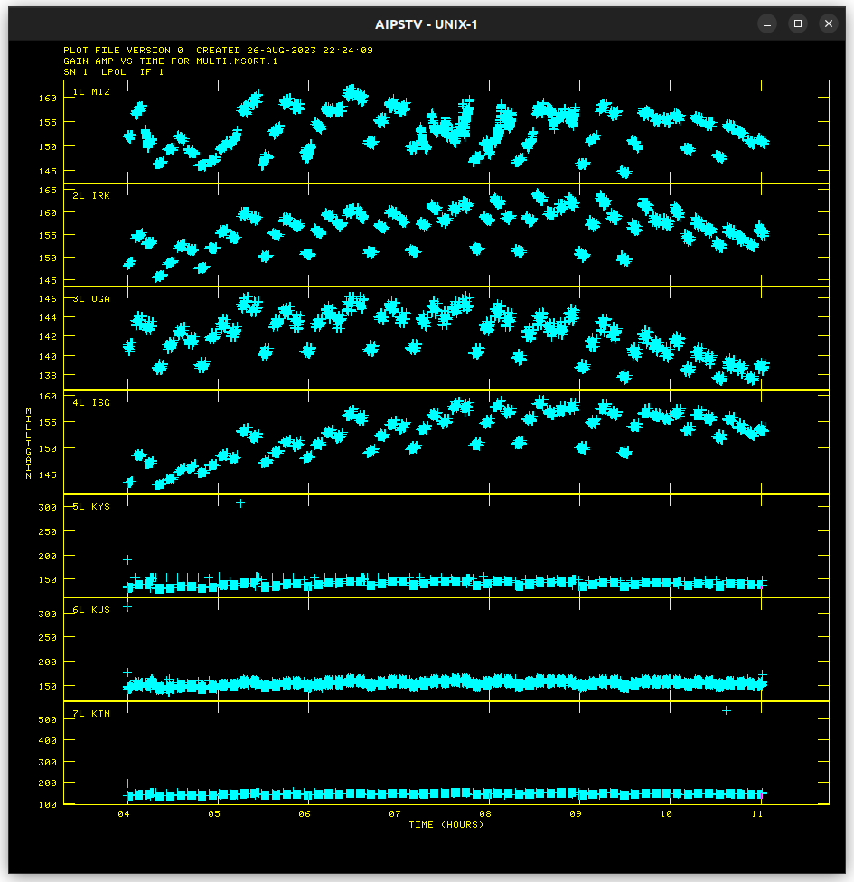
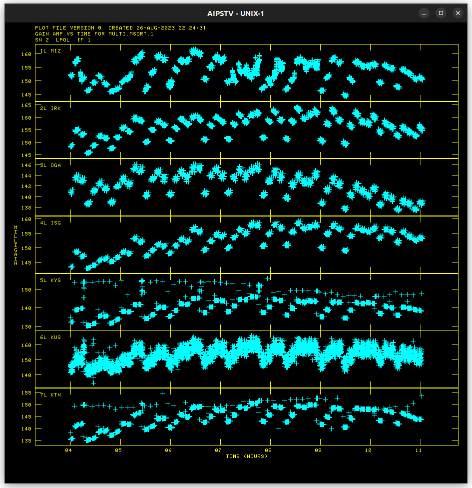
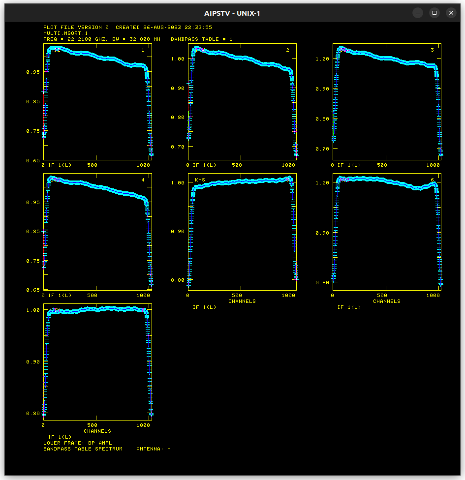

# K18TH01H Progress

## Amplitude Calibration

### ACCOR solution

* Flagging required for KVN stations

### ANTAB solution

### BPASS solution

### Amplitude Calibration Results

* [NRAO530](Resources/k18th01h/amplitude_cal_NRAO530.md)
* [RCW142](Resources/k18th01h/amplitude_cal_RCW142.md)
