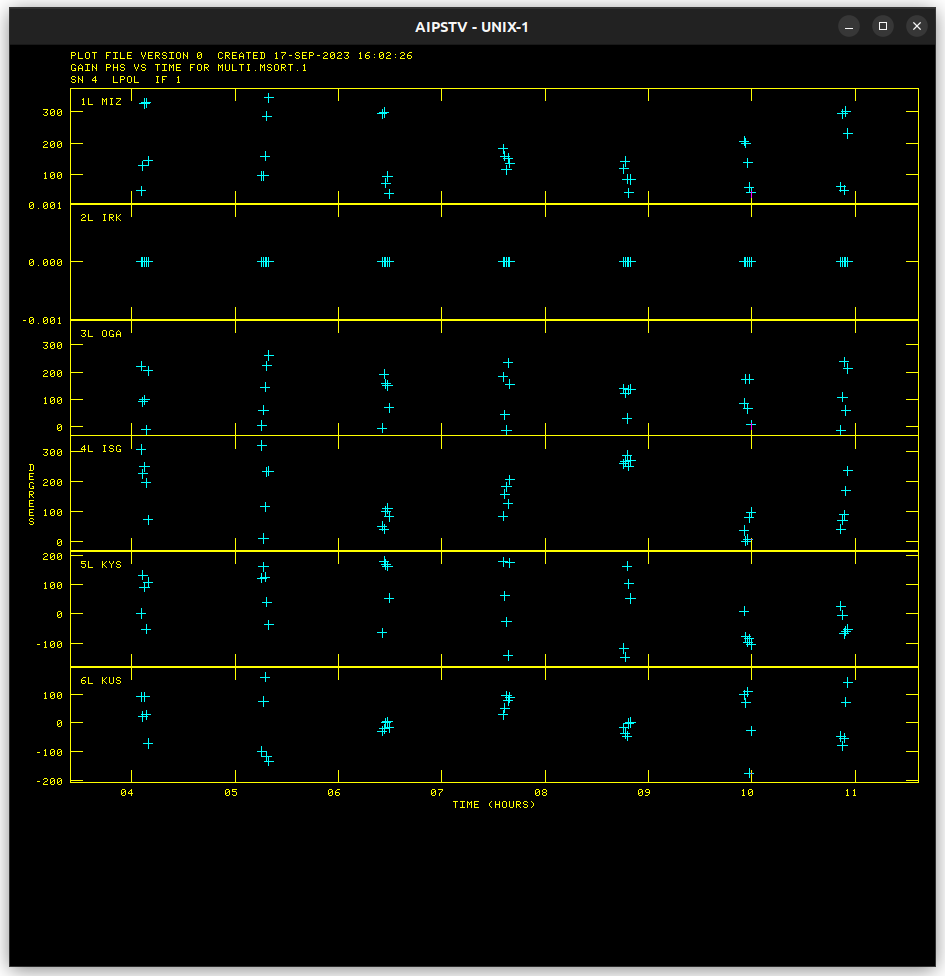
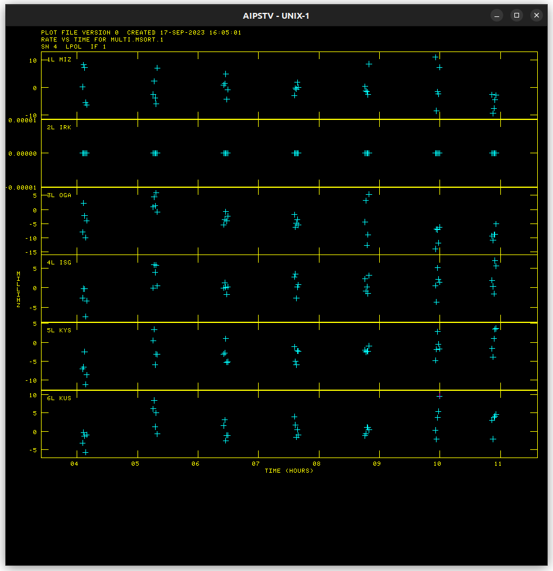
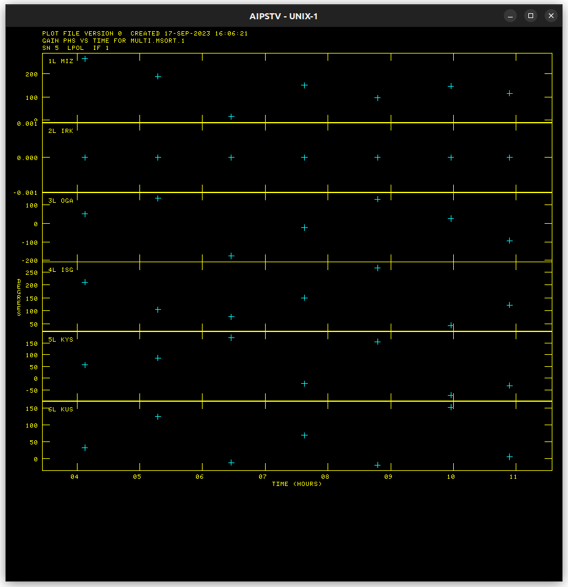
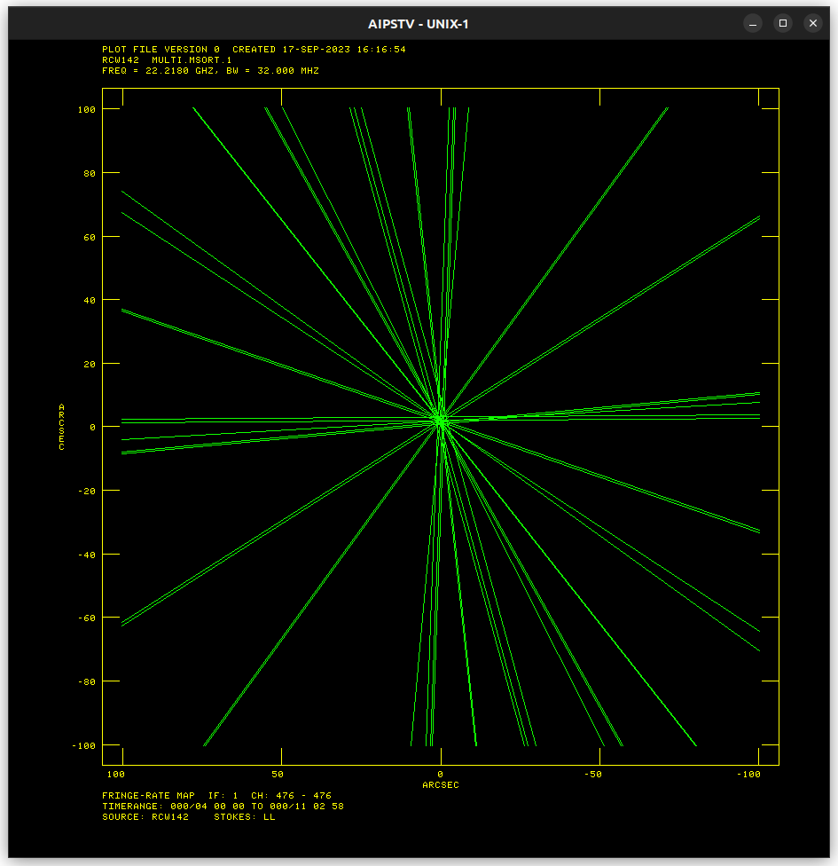
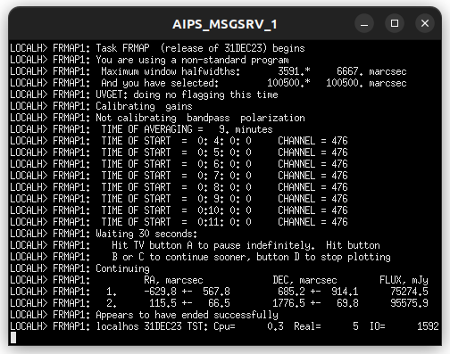
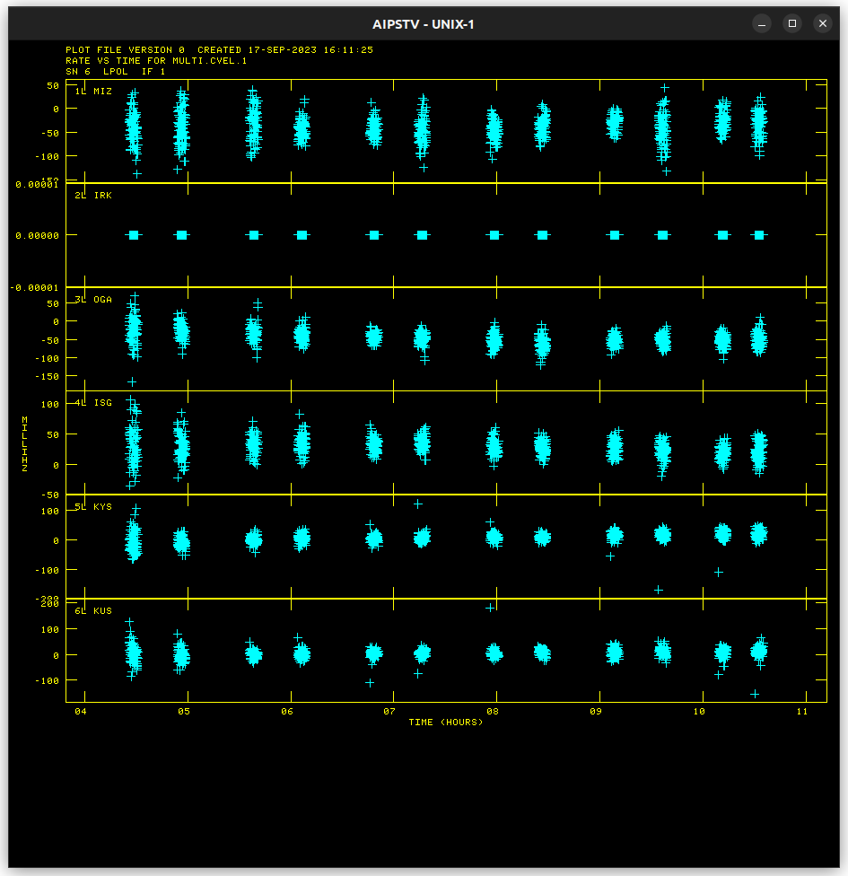

# K18TH01H Progress

## Amplitude Calibration

### ACCOR solution

* Flagging required for KVN stations

### ANTAB solution

### BPASS solution

### Amplitude Calibration Results

* [NRAO530](Resources/k18th01h/amplitude_cal_NRAO530.md)
* [RCW142](Resources/k18th01h/amplitude_cal_RCW142.md)

## Delay Calibration

### NRAO530 FRING for NRAO530 solution

### NRAO530 FRING for RCW142 solution

### Delay Calibration Results

* [NRAO530](Resources/k18th01h/delay_cal_NRAO530.md)
* [RCW142](Resources/k18th01h/delay_cal_RCW142.md)

## FRMAP Results

## Rate Calibration

### RCW142 FRING for RCW142 solution

* [RCW142](Resources/k18th01h/rate_cal_RCW142.md)
