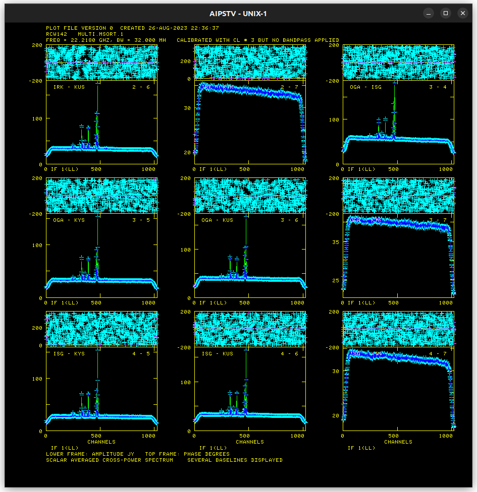

# K18TH01H Progress

## Amplitude Calibration

### ACCOR solution

* Flagging required for KVN stations

### ANTAB solution

### BPASS solution

### RCW 142 (Amplitude Calibration) results

* Baseline-averaged auto-correlation

* Baseline-averaged cross-correlation

* Per-baseline cross-correlation

* Per-baseline cross-correlation (300-500)

## Delay Calibration

### NRAO 530 image

### FRING solution for RCW 142

### RCW 142 (Delay Calibration) results

* Baseline-averaged cross-correlation

* Per-baseline cross-correlation

Peaks found:

1. Channel 476: Brightest, ~180 Jy
2. Channel 464: Second brightest, ~120 Jy
3. Channel 470: Between two brightest components, ~80 Jy
4. Channel 389: One of pair peaks, third brightest, ~95 Jy
5. Channel 327: One of pair peaks, third brightest, ~95 Jy
6. Channel 357: Between pair peaks, weakest single peak emission, ~75 Jy

---

## Rate Calibration

* Uses channel 476
* Baseline-averaged cross-correlation

* Per-baseline cross-correlation

