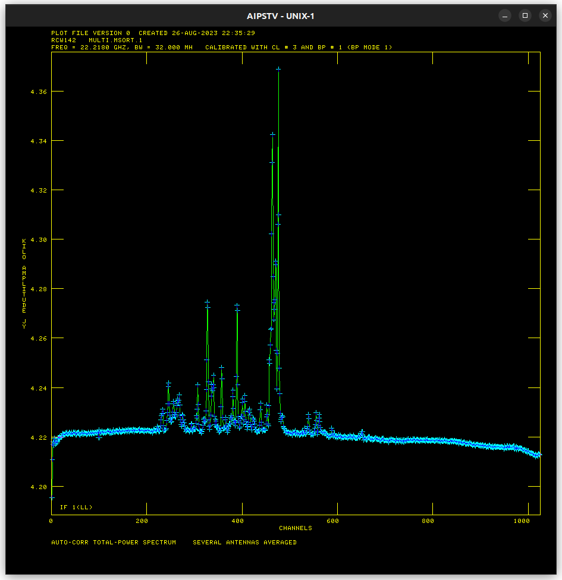

# K18TH01H Progress

## ACCOR solution

* No flagging needed

## ANTAB solution

## RCW 142 Pre-FRING (Amplitude calibration complete) results

* Baseline-averaged auto-correlation

* Baseline-averaged cross-correlation

* Per-baseline cross-correlation

* Per-baseline cross-correlation (300-500)

## Preliminary phase calibration (dummy+instrumental) results

* NRAO 530 image

* Baseline-averaged cross-correlation

* Per-baseline cross-correlation

Peaks found:

1. Channel 476: Brightest, ~180 Jy
2. Channel 464: Second brightest, ~120 Jy
3. Channel 470: Between two brightest components, ~80 Jy
4. Channel 389: One of pair peaks, third brightest, ~95 Jy
5. Channel 327: One of pair peaks, third brightest, ~95 Jy
6. Channel 357: Between pair peaks, weakest single peak emission, ~75 Jy

* Visibility-time plots
  * Channel 476

  * Channel 464

  * Channel 470

  * Channel 389

  * Channel 327

  * Channel 357

## Preliminary phase+rate calibration (line) results

* Baseline-averaged cross-correlation

* Per-baseline cross-correlation

