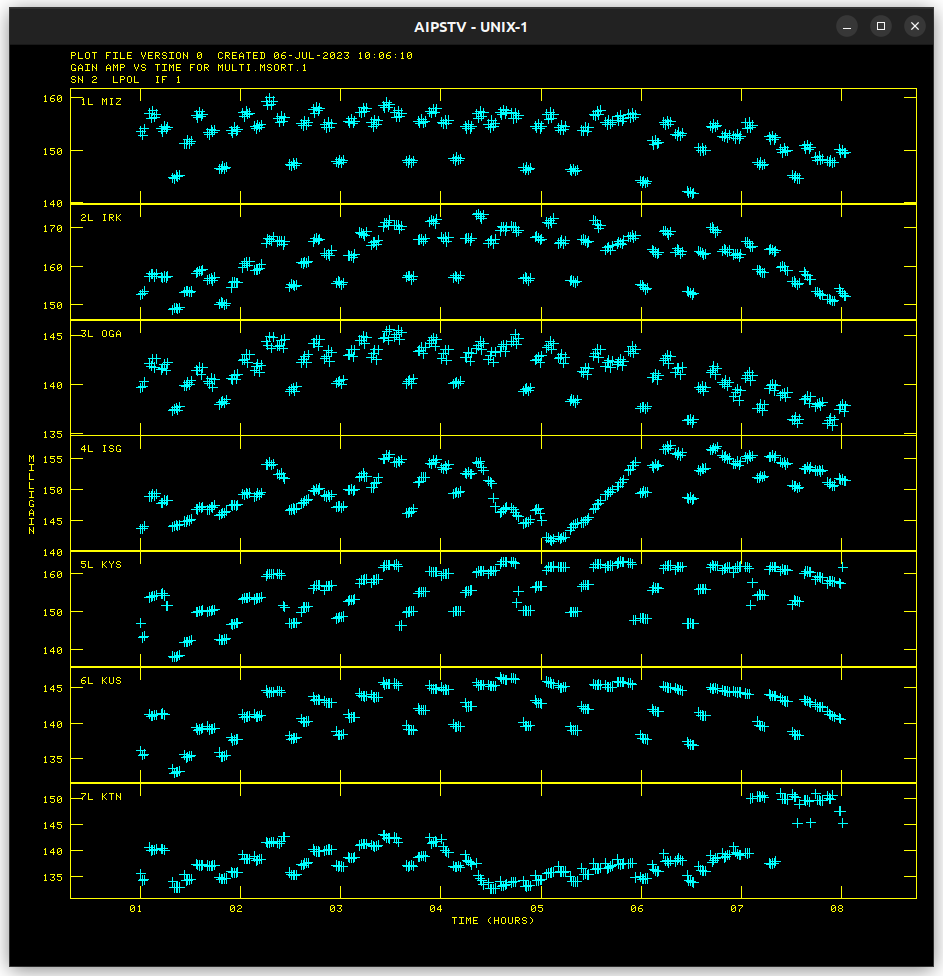
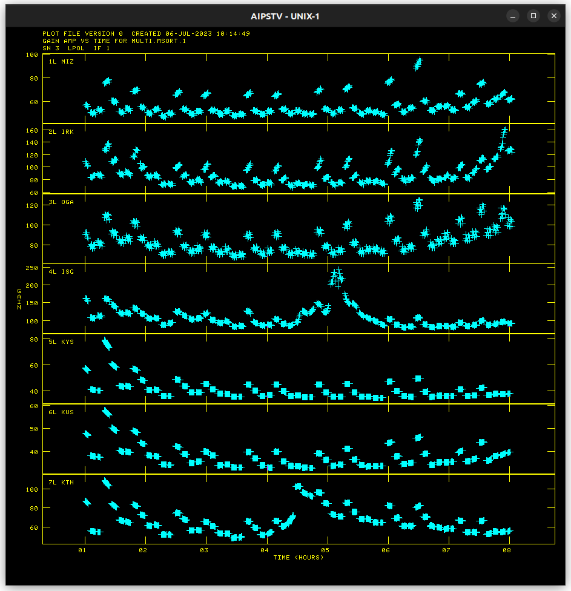
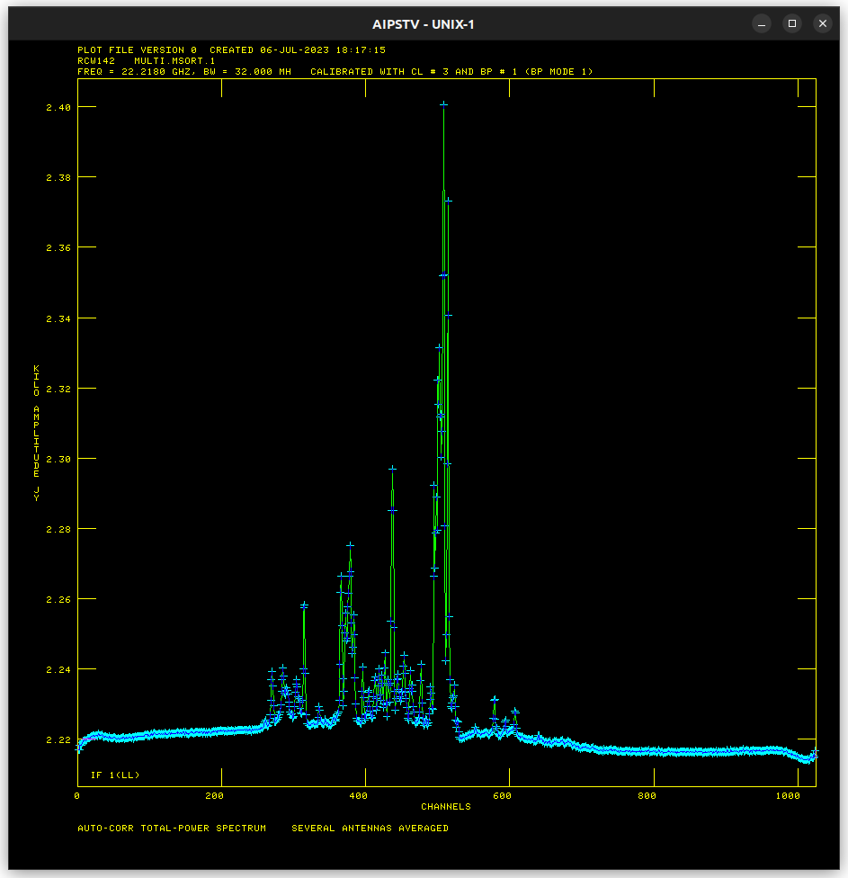
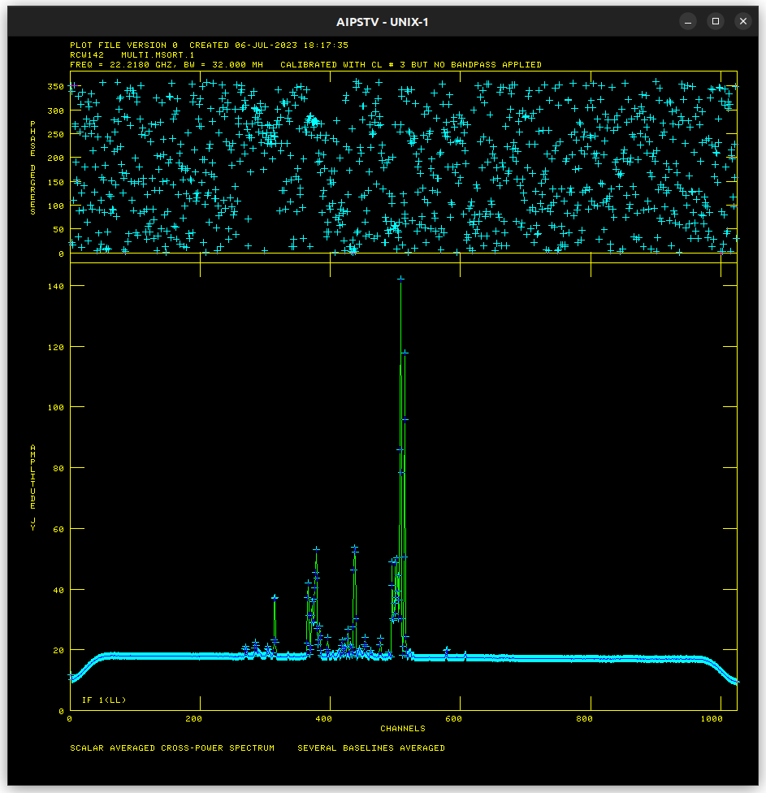
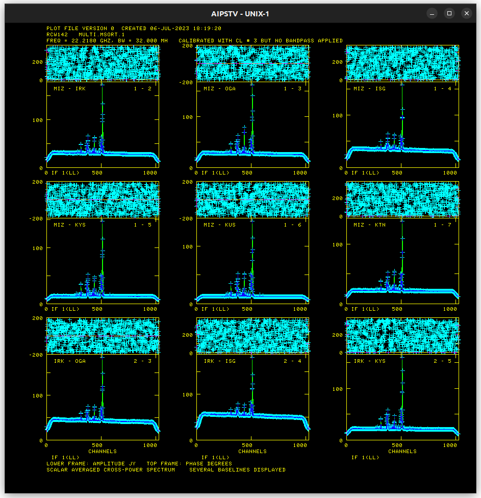
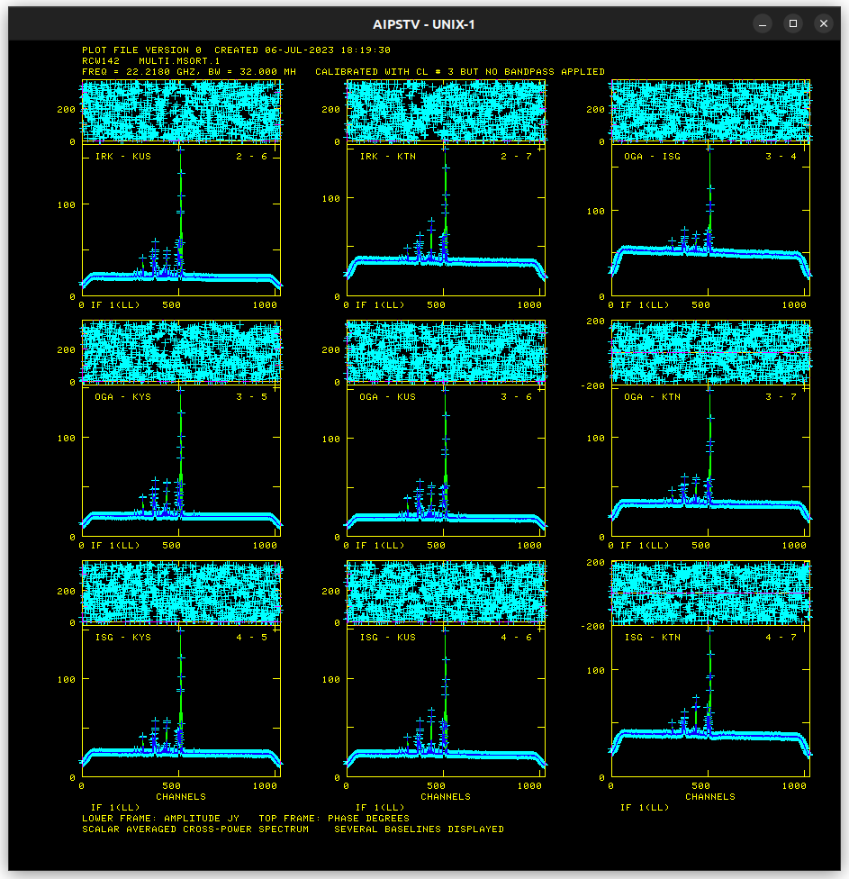
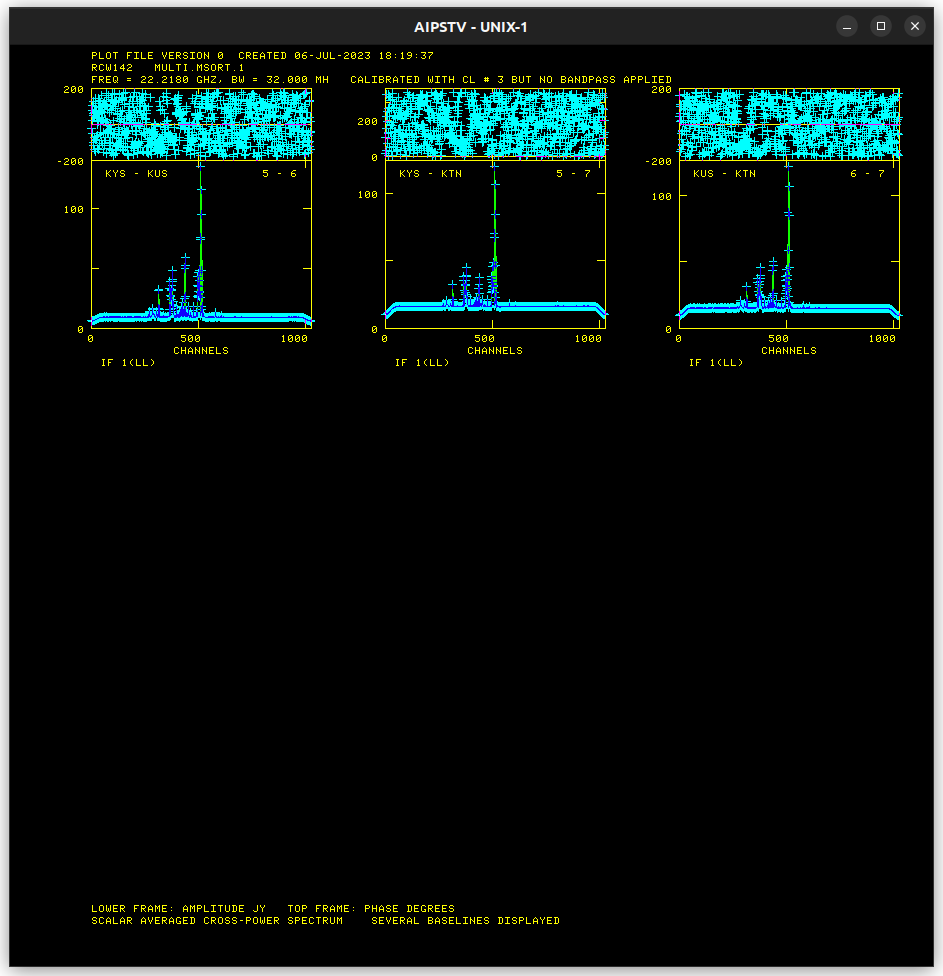
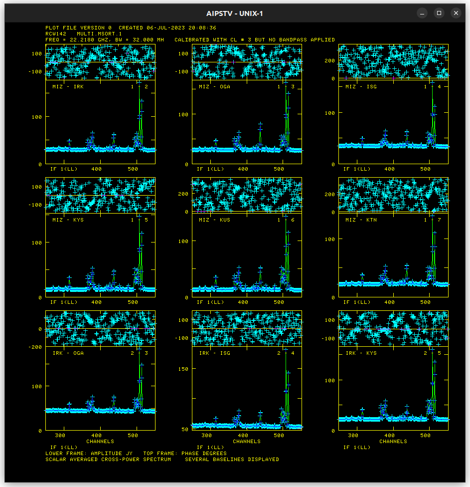
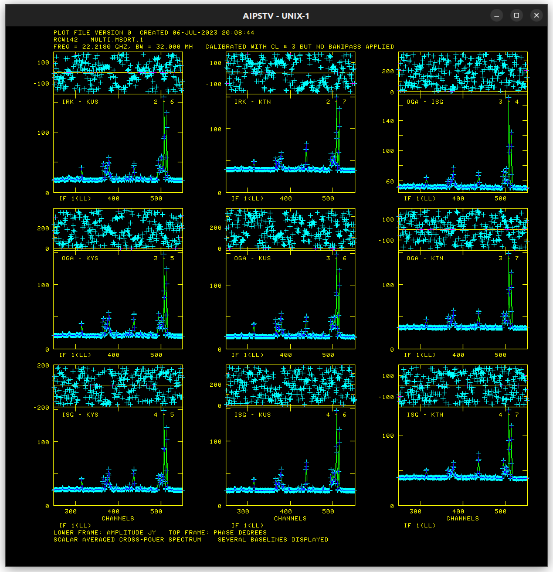
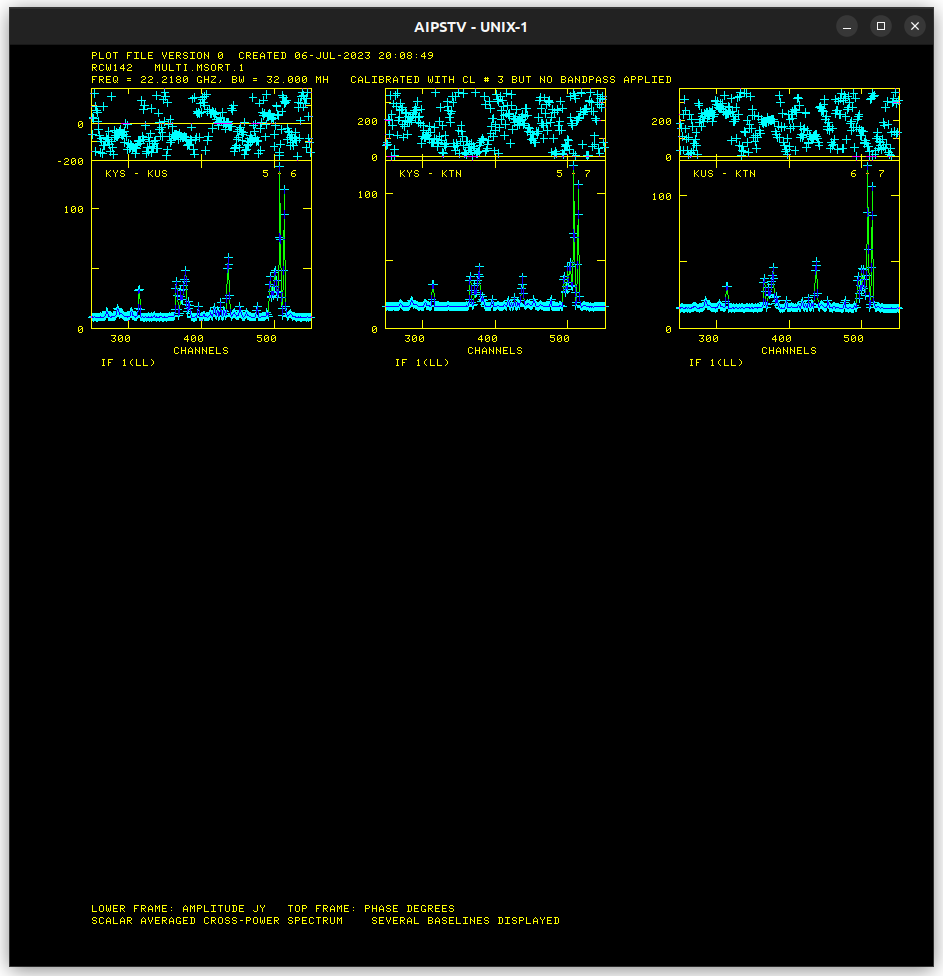

# K18TH01M Progress

## ACCOR solution

## ANTAB solution

## RCW 142 Pre-FRING (Amplitude calibration complete) results

* Baseline-averaged auto-correlation

* Baseline-averaged cross-correlation

* Per-baseline cross-correlation

* Per-baseline cross-correlation (250-550)

